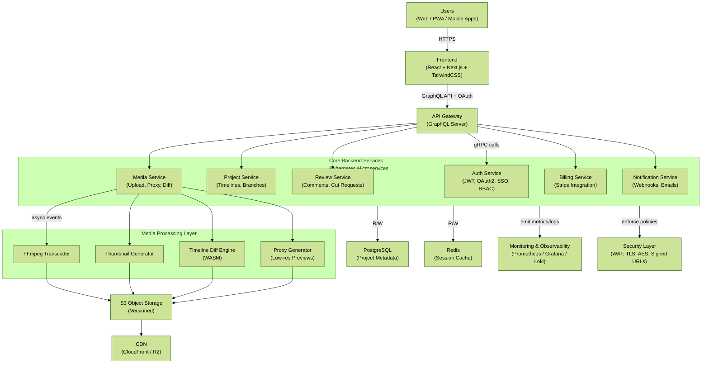

# CineGit

**The GitHub for Video Editing and Filmmaking**  
A cloud-native collaboration and version control platform for creative media workflows.

---

## 🧭 Project Vision

CineGit brings Git-style version control and collaborative editing tools to video workflows. It enables branching, timeline diffing, cut requests, secure media storage, and real-time reviews — redefining how creative teams collaborate on video projects.

---

## 📈 Market Gap & Opportunity

### Problem
- Filmmaking teams rely on chaotic file naming (`final_final_really_final.mp4`).
- No safe way to branch creative ideas or merge edits across users.
- Existing platforms (Frame.io, Dropbox) don't support Git-style workflows.

### CineGit Solution
- True timeline versioning and structured project branching.
- Frame-accurate inline reviews and cut approvals.
- Visual diffs of edit timelines, asset management, and secure cloud delivery.

---

## 👤 Target Users

| Persona      | Description                              | Needs                                 |
|--------------|------------------------------------------|---------------------------------------|
| Indie Editor | Remote team, small crew                  | Safe branching, low-overhead tools    |
| YouTuber     | High-output, frequent content creation   | Quick review & version control        |
| Studio PM    | Manages large teams & approvals          | Access control, audit trails          |
| VFX House    | High-volume asset management             | Proxies, diffing, media security      |

---

## 🚀 MVP Features

- ✅ Timeline Versioning
- ✅ Asset Upload & Management
- ✅ Timeline Branching System
- ✅ Cut Requests (Pull Request for Timelines)
- ✅ Visual Timeline Diff Viewer (insert/delete/move)
- ✅ Frame-accurate Commenting & Review
- ✅ Role-Based Access Control
- ✅ Activity Logs

---

## 🎯 Post-MVP Roadmap

- 🤖 AI-Assisted Merge Conflict Resolution
- 🔁 Offline Cloning with Sync
- 🎞️ Automatic Proxy Generation
- 🔌 Plugins: Premiere, Resolve, FCPX
- 🎥 Cloud Rendering Farm Integrations

---

## 🧱 System Architecture

---

## 🗂 Database Schema (Initial Draft)

| Table       | Key Fields                                                 |
|-------------|------------------------------------------------------------|
| Users       | id, email, name, role, auth_provider, timestamps           |
| Projects    | id, owner_id, title, description, visibility, timestamps   |
| Branches    | id, project_id, name, parent_branch_id, timestamps         |
| Assets      | id, project_id, branch_id, file_path, proxy_path, metadata |
| Timelines   | id, project_id, branch_id, timeline_json, timestamps       |
| CutRequests | id, from_branch_id, to_branch_id, status, timestamps       |
| Comments    | id, project_id, asset_id, timestamp, comment_text, user_id |

---

## 🛠 Tech Stack

### Frontend
- **React** + **Next.js**
- **TailwindCSS**
- **PWA** support
- Zustand or Redux for state
- GraphQL client (Apollo)

### Backend
- **GoLang microservices**
- **GraphQL API Gateway**
- **gRPC** for service communication
- **PostgreSQL** (metadata)
- **Redis** (caching & diff storage)

### Media Layer
- **FFmpeg** processing (Lambda/EKS)
- **WebAssembly** timeline diff engine
- **S3 + CloudFront** for media delivery
- **Deduplication** using fingerprint hashes

### Infrastructure
- **Kubernetes** (EKS)
- **Terraform** for IAC
- **Prometheus + Grafana + Loki**
- **CI/CD** with GitHub Actions + ArgoCD

---

## 🔒 Security

- AES-256 encryption at rest
- TLS 1.3 enforced in transit
- Signed upload/download URLs
- OWASP Top 10 hardened APIs
- Web Application Firewall (WAF)
- Role-based access control (RBAC)

---

## 📏 Performance Requirements

- Timeline diff <2s for 500+ edits
- Video uploads >20GB with multipart S3
- Proxy generation auto-triggers within 60s
- Global CDN delivery (CloudFront or R2)

---

## 📊 Business Model

| Plan         | Price         | Features                                   |
|--------------|---------------|--------------------------------------------|
| Freemium     | Free          | 20 GB, 2 collaborators                     |
| Studio       | $29/user/mo   | Unlimited projects, 5TB, private domains   |
| Per-Project  | One-time fee  | Short-term project workflows               |
| Enterprise   | Custom        | Private cloud, SSO, priority support       |

---

## 🌐 Integrations

- **Plugins**: Adobe Premiere Pro, DaVinci Resolve, FCPX
- **Webhooks**: Custom automation triggers
- **Zapier**: Marketing/ops integrations
- **API**: Full REST/GraphQL for automation

---

## 📅 Roadmap (Year 1)

| Phase     | Timeline      | Deliverables                                     |
|-----------|---------------|--------------------------------------------------|
| Phase 1   | Months 1–4    | Uploads, Branches, Project Structure             |
| Phase 2   | Months 5–8    | Review Tools, Cut Requests, Timeline Diff        |
| Phase 3   | Months 9–12   | Billing, SSO, NLE Plugin Alpha, Studio Tools     |

---

## 📣 Landing Page Copy (Quick Draft)

**Headline:**  
*The GitHub for Filmmakers*

**Subheadline:**  
Branch timelines. Review edits. Merge cuts.  
CineGit brings cloud-based version control to creative workflows.

**CTA:**  
[Start Free] [Book Demo]

---

## 📈 Metrics to Track

- User growth rate (monthly)
- # of projects created
- GB of media uploaded
- Branches and cut requests per project
- Review comment activity
- System uptime and processing time

---

## 🧩 Future Directions

- Public "Open Source Film" repositories
- Timeline analytics (AI edit suggestions)
- Integration with render farms
- Monetization APIs (NFT/tokenized distribution of edits)

---

**🚀 Built for the future of collaborative, cloud-native film production.**
