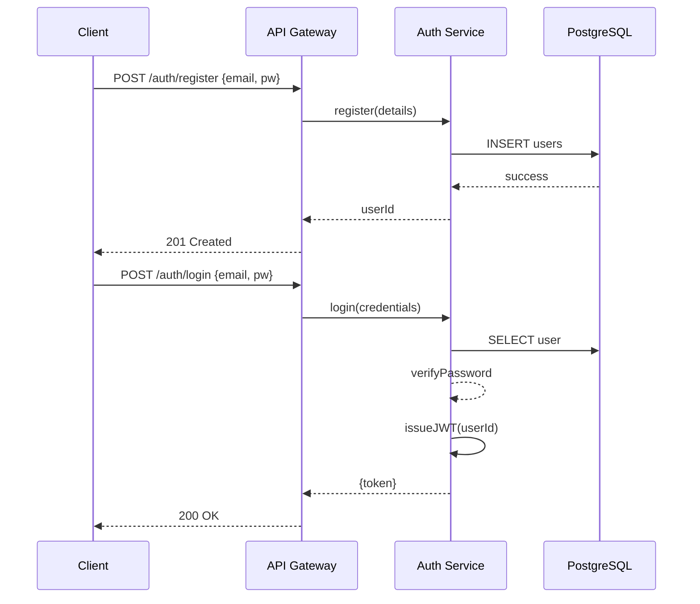
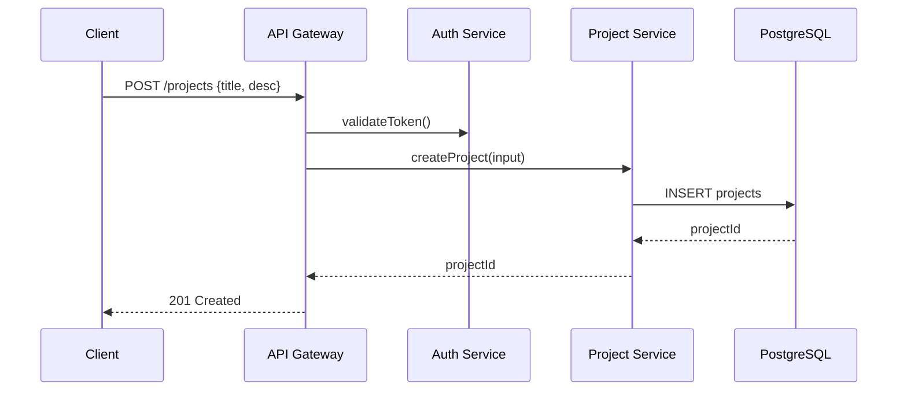
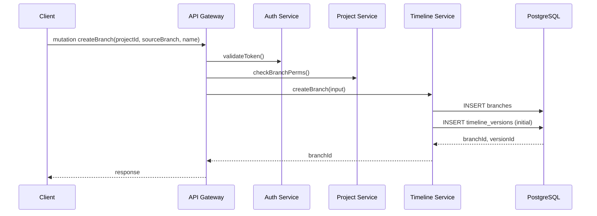
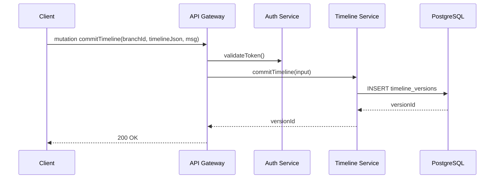
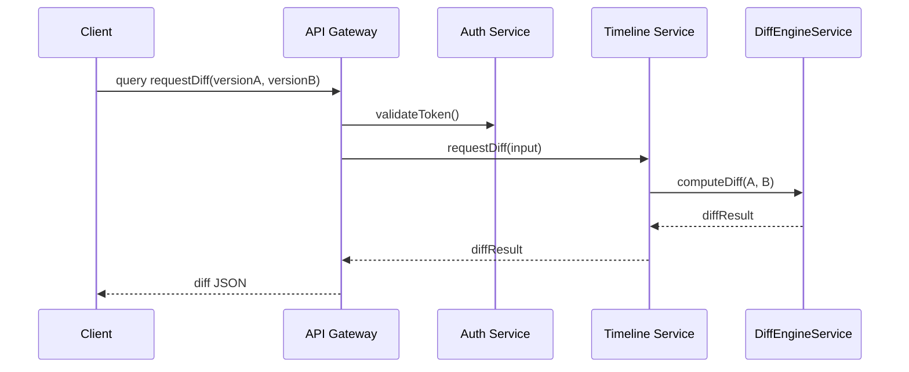
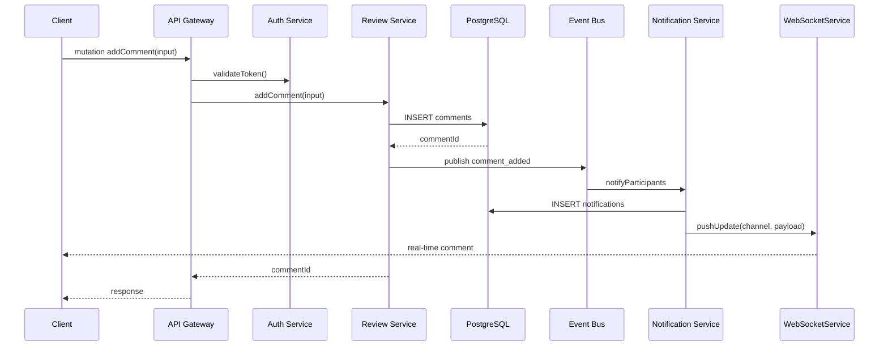
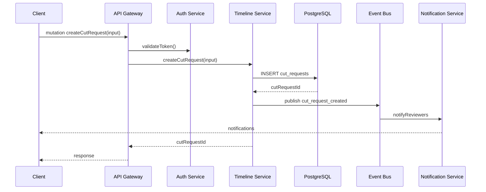
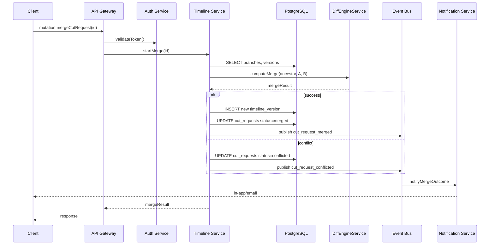
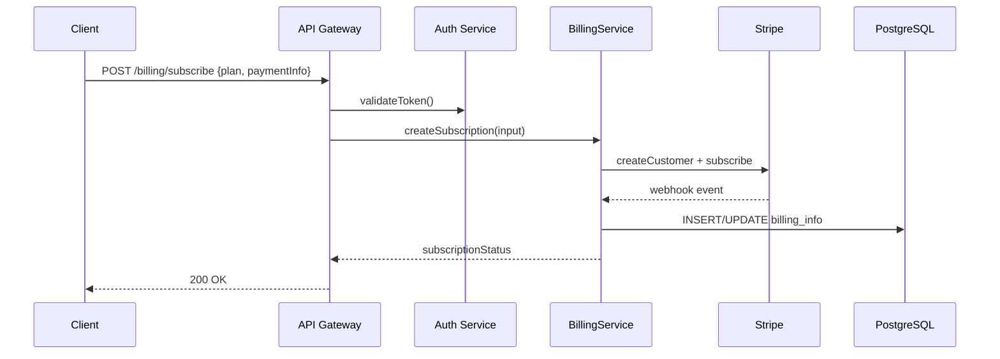

# CineGit – Architecture Diagrams

Below are the refreshed Mermaid diagrams covering **all** core functionalities:

---

## 1. Class Diagrams

### 1.1 Domain Model

```mermaid
classDiagram
    %% Domain entities and relationships
    class Organization {
        +UUID id
        +String name
        +String subscriptionPlan
        +DateTime createdAt
        +DateTime updatedAt
    }
    class User {
        +UUID id
        +String email
        +String name
        +String role
        +DateTime createdAt
        +DateTime updatedAt
    }
    class Project {
        +UUID id
        +String title
        +String description
        +String visibility
        +DateTime createdAt
        +DateTime updatedAt
    }
    class Branch {
        +UUID id
        +String name
        +UUID parentBranchId
        +DateTime createdAt
        +DateTime updatedAt
    }
    class TimelineVersion {
        +UUID id
        +JSONB timelineJson
        +DateTime createdAt
        +DateTime updatedAt
    }
    class Asset {
        +UUID id
        +String filePath
        +String thumbnailPath
        +String proxyPath
        +JSONB metadata
        +DateTime createdAt
        +DateTime updatedAt
    }
    class CutRequest {
        +UUID id
        +String status
        +String message
        +DateTime createdAt
        +DateTime updatedAt
    }
    class Comment {
        +UUID id
        +Float timestamp
        +String text
        +UUID parentCommentId
        +DateTime createdAt
        +DateTime updatedAt
    }
    class Notification {
        +UUID id
        +String type
        +String message
        +Boolean read
        +DateTime createdAt
    }
    class BillingInfo {
        +UUID organizationId
        +String stripeCustomerId
        +String subscriptionId
        +DateTime periodEnd
    }

    %% Relationships
    Organization "1" -- "0..*" Project         : owns
    Organization "1" -- "0..*" User            : contains
    Organization "1" -- "1" BillingInfo       : billedBy
    User         "1" -- "0..*" ProjectMember  : participates
    Project      "1" -- "0..*" Branch          : has
    Branch       "1" -- "0..*" TimelineVersion : head
    TimelineVersion "1" -- "0..*" Asset        : uses
    TimelineVersion "1" -- "0..*" Comment       : receives
    Asset        "1" -- "0..*" Comment         : annotatedBy
    Branch       "1" -- "0..*" CutRequest      : source,target
    User         "1" -- "0..*" Comment         : author
    User         "1" -- "0..*" Notification    : receives
````

### 1.2 Service Interaction Classes

```mermaid
classDiagram
    %% Core microservices and their methods
    class APIGateway {
        +handleGraphQL(req)
        +handleREST(req)
    }
    class AuthService {
        +login(credentials)
        +register(details)
        +validateToken(token)
    }
    class ProjectService {
        +createProject(input)
        +listProjects(userId)
    }
    class TimelineService {
        +createBranch(input)
        +commitTimeline(input)
        +requestDiff(input)
        +createCutRequest(input)
        +mergeCutRequest(input)
    }
    class AssetService {
        +generateUploadUrl(assetMeta)
        +notifyUploadComplete(assetId)
    }
    class MediaProcessor {
        +processProxy(assetId)
        +generateThumbnail(assetId)
        +extractMetadata(assetId)
    }
    class DiffEngineService {
        +computeDiff(versionA, versionB)
        +computeMerge(ancestor, A, B)
    }
    class ReviewService {
        +addComment(input)
        +listComments(context)
    }
    class NotificationService {
        +sendEmail(event)
        +createInApp(event)
    }
    class BillingService {
        +createSubscription(input)
        +handleWebhook(event)
    }
    class WebSocketService {
        +pushUpdate(channel, payload)
    }

    %% Dependencies
    APIGateway ..> AuthService
    APIGateway ..> ProjectService
    APIGateway ..> TimelineService
    APIGateway ..> AssetService
    APIGateway ..> ReviewService
    APIGateway ..> BillingService

    AssetService ..> MediaProcessor        : triggers
    MediaProcessor --> AssetService        : callbacks
    TimelineService ..> DiffEngineService  : invokes
    DiffEngineService --> TimelineService  : callbacks

    ReviewService --> NotificationService : publishes
    NotificationService --> WebSocketService : pushes
```

---

## 2. Sequence Diagrams

### 2.1 User Registration & Login



### 2.2 Project Creation Flow



### 2.3 Branch Creation Flow



### 2.4 Timeline Commit Flow



### 2.5 Diff Calculation Flow



### 2.6 Add Comment Flow



### 2.7 Cut Request Flow



### 2.8 Merge Cut Request Flow



### 2.9 Billing Subscription Flow



All diagrams above cover:

* **Authentication** (registration/login)
* **Project** lifecycle (create/list)
* **Branch** creation & **Timeline** commits
* **Diff** requests & **Merge** handling
* **Asset** upload & **Media Processing**
* **Review** comments & **Real-time** updates
* **Cut Requests** & **Merge** flows
* **Billing** subscription integration
