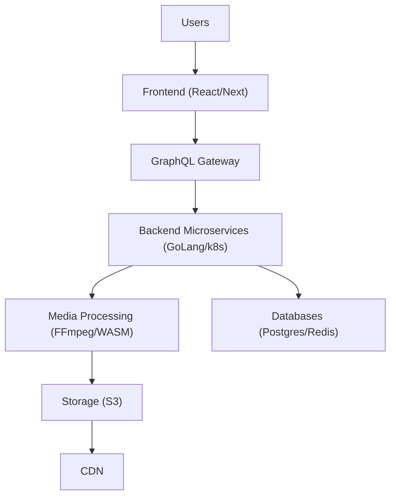

# CineGit: Project Analysis & Recommendations - Presentation Outline

---

## Slide 1: Title Slide

**CineGit: The GitHub for Video Editing**

*   Analysis and Implementation Recommendations
*   [Date: May 4, 2025]

---

## Slide 2: Introduction & Vision

*   **What is CineGit?** A cloud-native platform bringing Git-style version control and collaboration to video/film workflows.
*   **Vision:** Revolutionize creative media collaboration, addressing inefficiency and lack of structured versioning.
*   **Analogy:** Be the "GitHub for Filmmakers".

---

## Slide 3: The Problem & Market Opportunity

*   **Current Pains:** Chaotic file naming (`final_final.mp4`), no safe branching/merging, existing tools (Frame.io, Dropbox) lack deep timeline versioning.
*   **Market Gap:** Need for structured, Git-like workflows specifically for video timelines and assets.
*   **Opportunity:** Deliver a specialized solution for indie creators, YouTubers, studios, and VFX houses.

---

## Slide 4: CineGit Solution & Core Features (MVP)

*   **Core Concept:** True timeline versioning, branching, visual diffing, and collaborative review.
*   **MVP Features:**
    *   Timeline Versioning & Branching
    *   Asset Management (>20GB)
    *   **Cut Requests** (Timeline Pull Requests)
    *   **Visual Timeline Diff Viewer** (Insert/Delete/Move)
    *   Frame-accurate Commenting
    *   RBAC & Activity Logs
*   **Key Differentiator:** Focus on the *structure* of the edit (timeline), not just file versions or review comments.

---

## Slide 5: Target Users

*   **Indie Editor:** Needs safe branching, low overhead.
*   **YouTuber:** Needs quick review, version control.
*   **Studio PM:** Needs access control, audit trails.
*   **VFX House:** Needs proxies, diffing, security.

---

## Slide 6: System Architecture Overview

*   **Approach:** Cloud-Native, Microservices (GoLang) on Kubernetes (EKS).
*   **Frontend:** React/Next.js (Web, PWA).
*   **API:** GraphQL Gateway (inter-service via gRPC).
*   **Media:** FFmpeg processing (Async), WASM Diff Engine (Potential), S3 + CDN.
*   **Data:** PostgreSQL (Metadata), Redis (Cache).
*   **Ops:** Terraform, Prometheus/Grafana/Loki, CI/CD.

---

## Slide 7: Competitive Landscape

*   **Frame.io:** Strong in Review/Approval, lacks deep timeline versioning/branching.
*   **Filestage/Wipster:** Focus on review/approval workflow, not structural versioning.
*   **Evercast/cineSync:** Real-time review focus.
*   **Vidyard/Loom:** Video creation/sharing focus.
*   **CineGit's Niche:** True Git-like workflow for *timelines* - branching, diffing, merging edits.

---

## Slide 8: Key Implementation Recommendations (Tech)

*   **Validate WASM Diff Engine:** Prototype & benchmark performance (<2s) early. Have server-side fallback.
*   **Optimize Media Processing:** Use managed services or scalable compute (Lambda/Fargate) for FFmpeg (<60s proxy).
*   **Standardize Timeline Format:** Define extensible JSON structure (e.g., OTIO-based) for diff/merge.
*   **Asynchronous Media Workflow:** Use event-driven patterns (SQS/Kafka) for uploads/processing.
*   **Database Design:** Plan for PostgreSQL scaling; evaluate Redis for diff data.

---

## Slide 9: Key Implementation Recommendations (Features & Strategy)

*   **Prioritize MVP Differentiators:** Focus R&D on *Visual Diff Viewer* and *Cut Request/Merge* workflow.
*   **Emphasize Branching:** Market the safety and creative freedom.
*   **NLE Plugins:** Critical for adoption - prioritize post-MVP.
*   **Iterative Development:** Build core versioning engine first.
*   **Security:** Implement fine-grained RBAC early; conduct regular audits.

---

## Slide 10: Conclusion & Next Steps

*   **Strong Potential:** Addresses a clear market gap with a unique value proposition.
*   **Key Challenges:** Timeline diff engine complexity/performance, large media handling, NLE integration.
*   **Success Factors:** Prioritize core differentiators, validate tech early, iterate.
*   **Next Steps:** Focus on MVP development, particularly the diff engine and cut request workflow.

